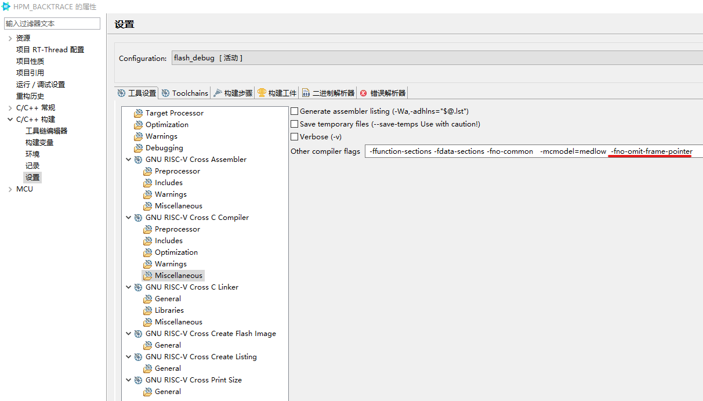

## 简介

RVBacktrace是一个极简的RISC-V栈回溯组件。用于断言或异常等情况下的辅助调试。

## 组件功能

### 基础功能

1. 从调用位置栈回溯(支持支持FP模式栈回溯/软件栈回溯)
2. 命令查看当前`RT-Thread`系统所有线程的调用栈（依赖RT-Thread/仅支持FP模式栈回溯）

### 进阶功能

1. 定位栈溢出位置，从溢出位置进行栈回溯，(需要结合gcc的-fstack-protector-strong参数/须同时开启FP模式栈回溯)

## API介绍

RVBacktrace组件仅包含一个面向用户的API，用户在需要的地方调用该函数可以进行从当前位置进行栈回溯，用户可将该API对接到断言函数或者在异常中调用，辅助调试。

```c
void rvbacktrace(void);
```

## 组件配置

组件支持两种方式栈回溯，当前默认使用配置简单的方式一，使用方式二请看下文的使用示例。

方式一：不添加编译参数，通过调用栈结构与指令类型进行栈回溯。

优点：不额外占用系统寄存器  缺点：增加代码空间，效率较方式一较低

方式二：通过添加编译参数的方式，基于FP寄存器进行栈回溯。

优点：几乎不增加代码空间 缺点：占用s0寄存器，

## 使用方法

方式一：

默认使用方式一，首先确认链接脚本中存在下述符号

```c
extern char *__etext;
extern char *__stext;
```

若不存在，请在链接脚本中添加上述符号，__ etext位于代码段的开始，__stext位于代码段的末尾，以下是在链接脚本中添加上述符号的示例位置：

```stylus
	PROVIDE (__stext = .);
    .text (__vector_load_addr__ + __vector_ram_end__ - __vector_ram_start__) : {
        . = ALIGN(8);
        *(.text)
        *(.text*)
        *(.rodata)
        *(.rodata*)
        *(.srodata)
        *(.srodata*)
        ...
            /* section information for usbh class */
        . = ALIGN(8);
        __usbh_class_info_start__ = .;
        KEEP(*(.usbh_class_info))
        __usbh_class_info_end__ = .;

    } > XPI0

    .rel : {
        KEEP(*(.rel*))
    } > XPI0

    PROVIDE (__etext = .);
```

在期望栈回溯的地方插入rvbacktrace函数，示例如下：

```stylus
void thread_entry(void *arg)
{
    rt_thread_mdelay(500);
    extern void rvbacktrace();
    rvbacktrace();
    while(1){
        app_led_write(0, APP_LED_ON);
        rt_thread_mdelay(500);
        app_led_write(0, APP_LED_OFF);
        rt_thread_mdelay(500);
    }
}
```

运行结果：

```stylus
---- RV_Backtrace Call Frame Start: ----
###Please consider the value of ra as accurate and the value of sp as only for reference###
------------------------------Thread: led_th backtrace------------------------------
[0]Stack interval :[0x000000000108f868 - 0x000000000108f878]  ra 0x000000008000cc6c pc 0x000000008000cc6a
[1]Stack interval :[0x000000000108f878 - 0x000000000108f888]  ra 0x000000008000cc6a pc 0x000000008000cc68
[2]Stack interval :[0x000000000108f888 - 0x000000000108f898]  ra 0x000000008000c92e pc 0x000000008000c92c
[3]Stack interval :[0x000000000108f898 - 0x000000000108f8a0]  ra 0x000000008001007e pc 0x000000008001007a
End of stack backtracking

addr2line -e rtthread.elf -a -f 8000cc6a 8000cc68 8000c92c 8001007a
---- RV_Backtrace Call Frame End:----
```

方式二：

首先在rvacktrace.h中定义BACKTRACE_USE_FP

```stylus
#define BACKTRACE_USE_FP
```

在C/C++以及汇编的编译选项下添加`-fno-omit-frame-pointer`编译参数，RT-Studio中的添加方式示例：



在期望栈回溯的地方插入rvbacktrace函数，示例如下：

```stylus
void thread_entry(void *arg)
{
    rt_thread_mdelay(500);
    extern void rvbacktrace();
    rvbacktrace();
    while(1){
        app_led_write(0, APP_LED_ON);
        rt_thread_mdelay(500);
        app_led_write(0, APP_LED_OFF);
        rt_thread_mdelay(500);
    }
}
```

运行结果：

```stylus
---- RV_Backtrace Call Frame Start: ----
###Please consider the value of ra as accurate and the value of sp as only for reference###
------------------------------Thread: led_th backtrace------------------------------
Current Thread Name:  led_th
[0]Stack interval :[0x0000000001090388 - 0x0000000001090398]  ra 0x000000008000d114 pc 0x000000008000d110
[1]Stack interval :[0x0000000001090398 - 0x00000000010903a8]  ra 0x000000008000cfba pc 0x000000008000cfb6
[2]Stack interval :[0x00000000010903a8 - 0x00000000010903b8]  ra 0x000000008001095a pc 0x0000000080010956
[3]Stack interval :[0x00000000010903b8 - 0x00000000deadbeef]  ra 0x0000000001086a7c pc 0x0000000001086a78

addr2line -e rtthread.elf -a -f 8000d110 8000cfb6 80010956 1086a78
---- RV_Backtrace Call Frame End:----
```

上述信息便是当前的栈回溯信息，除此之外组件输出addr2line工具支持的栈回溯命令，使用addr2line命令运行下述代码即可查看函数调用栈与函数符号。

```stylus
addr2line -e rtthread.elf -a -f 8000d110 8000cfb6 80010956 1086a78
```

执行上述命令的示例结果如下图所示：


方式二支持对当前系统所有的线程进行栈回溯，在rvacktrace.h中定义BACKTRACE_ALL即可输出当前系统各线程的调用栈。

```stylus
#define BACKTRACE_ALL 
```

重新执行上述代码，运行结果：

```stylus
---- RV_Backtrace Call Frame Start: ----
###Please consider the value of ra as accurate and the value of sp as only for reference###
------------------------------Thread: led_th backtrace------------------------------
Current Thread Name:  led_th
[0]Stack interval :[0x0000000001090390 - 0x00000000010903a0]  ra 0x000000008000d26e pc 0x000000008000d26a
[1]Stack interval :[0x00000000010903a0 - 0x00000000010903b0]  ra 0x000000008000cfba pc 0x000000008000cfb6
[2]Stack interval :[0x00000000010903b0 - 0x00000000010903c0]  ra 0x0000000080010ac2 pc 0x0000000080010abe
[3]Stack interval :[0x00000000010903c0 - 0x00000000deadbeef]  ra 0x0000000001086a7c pc 0x0000000001086a78

addr2line -e rtthread.elf -a -f 8000d26a 8000cfb6 80010abe 1086a78

------------------------------Thread: tshell backtrace------------------------------
[1]Thread Name:  tshell
[0]Stack interval :[0x000000000108fea0 - 0x000000000108fed0]  ra 0x0000000001083f5c pc 0x0000000001083f58
[1]Stack interval :[0x000000000108fed0 - 0x000000000108fee0]  ra 0x0000000001084782 pc 0x000000000108477e
[2]Stack interval :[0x000000000108fee0 - 0x000000000108ff00]  ra 0x0000000080009d80 pc 0x0000000080009d7c
[3]Stack interval :[0x000000000108ff00 - 0x000000000108ff10]  ra 0x0000000080009eec pc 0x0000000080009ee8
[4]Stack interval :[0x000000000108ff10 - 0x00000000deadbeef]  ra 0x0000000001086a7c pc 0x0000000001086a78

addr2line -e rtthread.elf -a -f 1083f58 108477e 80009d7c 80009ee8 1086a78
------------------------------Thread: tidle0 backtrace------------------------------
[2]Thread Name:  tidle0
[0]Stack interval :[0x000000000108bf70 - 0x00000000deadbeef]  ra 0x0000000001086a7c pc 0x0000000001086a78

addr2line -e rtthread.elf -a -f 1086a78
------------------------------Thread: timer backtrace------------------------------
[3]Thread Name:  timer
[0]Stack interval :[0x000000000108c408 - 0x000000000108c428]  ra 0x0000000001088636 pc 0x0000000001088632
[1]Stack interval :[0x000000000108c428 - 0x00000000deadbeef]  ra 0x0000000001086a7c pc 0x0000000001086a78

addr2line -e rtthread.elf -a -f 1088632 1086a78
------------------------------Thread: main backtrace------------------------------
[4]Thread Name:  main
[0]Stack interval :[0x000000000108ebd8 - 0x000000000108ec08]  ra 0x0000000001086f68 pc 0x0000000001086f64
[1]Stack interval :[0x000000000108ec08 - 0x000000000108ec18]  ra 0x0000000001087096 pc 0x0000000001087092
[2]Stack interval :[0x000000000108ec18 - 0x000000000108ec28]  ra 0x0000000080010b84 pc 0x0000000080010b80
[3]Stack interval :[0x000000000108ec28 - 0x000000000108ec38]  ra 0x0000000080006890 pc 0x000000008000688c
[4]Stack interval :[0x000000000108ec38 - 0x00000000deadbeef]  ra 0x0000000001086a7c pc 0x0000000001086a78

addr2line -e rtthread.elf -a -f 1086f64 1087092 80010b80 8000688c 1086a78
Thread Total Num: 5
---- RV_Backtrace Call Frame End:----
```

该模式用于tshell线程可以正常执行时打印输出当前系统所有线程的调用栈，用于辅助分析死锁，线程异常挂起等现象

## 进阶功能示例

### 1.栈溢出检测

在rvbacktrace.h文件中定义下述宏：

```stylus
#define BACKTRACE_USE_FP
#define BACKTRACE_FSTACK_PROTECT
```

在C/C++并编译参数中添加`-fstack-protector-strong`,在连接参数中添加`-Wl,--wrap,_exit`，最后添加下述示例代码编译运行

```stylus
int main(void)
{
    char array[5] = {0};
    rt_strcpy(array, "stack leak test");
    
    return 0;
}
```

运行结果：

```stylus
*** stack smashing detected ***: terminated

---- RV_Backtrace Call Frame Start: ----
###Please consider the value of ra as accurate and the value of sp as only for reference###
------------------------------Thread: main backtrace------------------------------
Current Thread Name:  main
[0]Stack interval :[0x000000000108ef38 - 0x000000000108ef48]  ra 0x000000008000d450 pc 0x000000008000d44c
[1]Stack interval :[0x000000000108ef48 - 0x000000000108ef58]  ra 0x000000008000d2bc pc 0x000000008000d2b8
[2]Stack interval :[0x000000000108ef58 - 0x000000000108ef68]  ra 0x000000008000d368 pc 0x000000008000d364
[3]Stack interval :[0x000000000108ef68 - 0x000000000108efc8]  ra 0x0000000080012224 pc 0x0000000080012220
[4]Stack interval :[0x000000000108efc8 - 0x000000000108efd8]  ra 0x0000000080006890 pc 0x000000008000688c
[5]Stack interval :[0x000000000108efd8 - 0x00000000deadbeef]  ra 0x0000000001086bc4 pc 0x0000000001086bc0

addr2line -e rtthread.elf -a -f 8000d44c 8000d2b8 8000d364 80012220 8000688c 1086bc0
---- RV_Backtrace Call Frame End:----

[W/stdlib] thread:main exit:127!
```

通过上述信息便可以定位到栈溢出的线程与代码位置。

## 验证平台

|     芯片/内核     | 验证结果 |
| :---------------: | :------: |
|  D1/XuanTianC906  |   pass   |
| CH32V307/RISC-V4F |   pass   |
| HPM6750/Andes D45 |   pass   |
| QEMU RISCV64 VIRT |   pass   |

## 参考链接

上手说明：https://club.rt-thread.org/ask/article/64bfe06feb7b3e29.html
